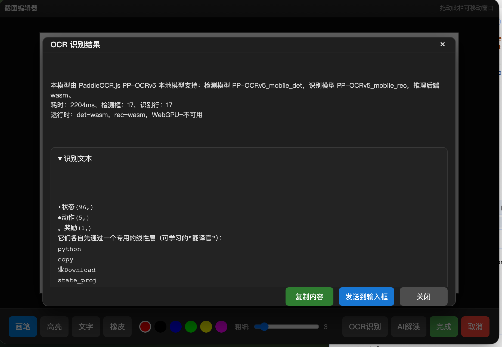

<div align="center">

# 研知科研助手 (Yanzhi Research Assistant)

AI 辅助科研知识体系助手
</br>
<em>Capture, understand, and organize research knowledge with AI.</em>

<p align="center">
  <a href="https://www.paddlepaddle.org.cn/"></a>
  <a href="https://github.com/PaddlePaddle/PaddleOCR"></a>
  <a href="https://github.com/PaddlePaddle/PaddleOCR/tree/main/paddleocr-js"></a>
</p>

<p align="center">
  <a href="https://github.com/ddddfrank/yanzhi/stargazers"></a>
  <a href="https://github.com/ddddfrank/yanzhi/network"></a>
  <a href="https://www.electronjs.org/"></a>
  <a href="https://nodejs.org/"></a>
</p>

</div>

研知科研助手是一款专为科研人员打造的智能化工具，旨在通过 AI 技术简化文献管理、笔记整理及知识体系构建流程，全面提升科研效率。

## 👥 合作者

- @Mnnnn- [Mnnnn](https://github.com/liulx25xx)
- @17825470707yx-sketch- [17825470707yx-sketch](https://github.com/17825470707yx-sketch)
- @soulll1- [soulll1](https://github.com/soulll1)
- @ZC_N- [ZC_N](https://github.com/Anachronism-N)
- 天朗教育

## ⚡ 项目定位

通过 SWOT 分析明确产品定位：聚焦科研场景下的知识捕获、智能理解和结构化沉淀，形成“获取-理解-组织-复用”的闭环。

<div align="center">

</div>

## 🚀 核心功能

| 功能模块 | 核心优势 |
| :--- | :--- |
| **网页信息精准获取** | 支持图片截取、网页保存与文本复制，灵活处理可见内容，覆盖图表与公式场景。 |
| **文献/笔记自动整理** | AI 深度主导，自动生成结构化科研笔记，显著降低人工整理负担。 |
| **定制化笔记模板** | 内置可视化模板构建能力，快速建立标准化科研记录范式。 |
| **知识体系高效构建** | 多层文件夹与条目体系协同，兼顾宏观主题与微观细节管理。 |

## 🎬 核心流程演示

<div align="center">
<table>
<tr>
<td align="center" width="50%">
<strong>1. 新建研究工作区</strong><br/>

</td>
<td align="center" width="50%">
<strong>2. 网页知识捕获（截图/摘录）</strong><br/>

</td>
</tr>
<tr>
<td align="center" width="50%">
<strong>3. 图片截取与保存</strong><br/>

</td>
<td align="center" width="50%">
<strong>4. AI 文献理解与整理</strong><br/>

</td>
</tr>
</table>
</div>

## 🖼️ 最终设计

<div align="center">

</div>

## 🛠️ 环境准备

在开始使用前，请确保系统已安装以下环境：

- **Node.js & npm**：用于运行 Electron 客户端
- **主要 npm 依赖**：
  - `electron`：桌面应用程序框架
  - `openai`：与大模型（如 Qwen）交互
  - `puppeteer-core`：驱动浏览器生成 PDF 或抓取网页
  - `pdf-parse`：解析 PDF 文档
  - `koffi`：Node.js FFI 能力
  - `@paddleocr/paddleocr-js`：浏览器端本地 OCR 推理

## 📦 快速开始

1. **克隆仓库**

```bash
git clone https://github.com/ddddfrank/yanzhi.git
cd yanzhi
```

2. **安装依赖**

```bash
npm install
```

3. **启动程序**

```bash
npm start
```

## ⚙️ 详细配置

### 1. API 配置

本软件默认使用 **本地 PaddleOCR.js + 硅基流动（SiliconCloud）Qwen2.5 7B**：PaddleOCR.js 在 Electron 浏览器上下文内运行 PP-OCRv5 识别截图文字，Qwen 负责后续图像内容解读和整理。

- 前往 [硅基流动官网](https://cloud.siliconflow.cn/) 注册并申请 API Key
- 将申请到的 Key 填入 [data/token.env](data/token.env)（将 txt 后缀改为 env）

### 2. PaddleOCR.js 本地 OCR 配置与调用链

当前 OCR 使用官方浏览器推理 SDK `@paddleocr/paddleocr-js@0.3.2`，在 Electron 本地 BrowserWindow 中运行，不依赖 PaddleOCR-VL、Python 服务或云端 OCR。当前模型版本为 `PP-OCRv5`：

- 检测模型：`PP-OCRv5_mobile_det`
- 识别模型：`PP-OCRv5_mobile_rec`
- 默认语言：`ch`
- 默认推理后端：`auto`，测试脚本固定使用 `wasm`
- 运行方式：Electron 主进程注册 `ppocrjs://local` 本地协议，在隐藏 BrowserWindow 中注入 PaddleOCR.js bundle，模型与 ORT wasm 均从本地缓存读取

PaddleOCR 官方将 `PaddleOCR.js` 定义为可在浏览器中运行 PP-OCR 产线的 OCR SDK，npm 包名为 `@paddleocr/paddleocr-js`。它通过 `PaddleOCR.create()` 初始化检测与识别模型，通过 `predict(image)` 返回识别行、置信度、耗时和实际运行后端；输入可以是 `Blob`、`File`、`ImageBitmap`、`ImageData`、`HTMLCanvasElement`、`HTMLImageElement` 等浏览器图像对象，也支持 worker 模式。

本项目采用的是 PaddleOCR 官方 PP-OCRv5 的轻量端侧组合，而不是 PaddleOCR-VL：

| 模块 | 本项目模型 | 官方基线/benchmark | 官方耗时参考 | 模型大小 |
| :--- | :--- | :--- | :--- | :--- |
| 文本检测 | `PP-OCRv5_mobile_det` | Detection Hmean `79.0%`，对比 `PP-OCRv4_mobile_det` 的 `63.8%` | GPU `10.67 / 6.36 ms`，CPU `57.77 / 28.15 ms` | `4.7 MB` |
| 文本识别 | `PP-OCRv5_mobile_rec` | 平均识别准确率 `81.29%`，对比 `PP-OCRv4_mobile_rec` 的 `78.74%`；多场景细分：中文 `81.29%`、英文 `66.00%`、繁中 `83.55%`、日文 `54.65%` | GPU `5.43 / 1.46 ms`，CPU `21.20 / 5.32 ms` | `16 MB` |

> 上表来自 PaddleOCR 官方文档。官方说明这些耗时只统计模型推理，不包含预处理、后处理、截图、Electron 窗口通信和 wasm 初始化；本项目弹窗内显示的 `耗时` 是端到端实际运行时间，因此更接近用户体感速度。PaddleOCR 官方 README 同时说明 PP-OCRv5 相比前代整体有约 `13%` 的准确率提升。

官方参考：

- [PaddleOCR GitHub README](https://github.com/PaddlePaddle/PaddleOCR)
- [PaddleOCR.js browser deployment](https://www.paddleocr.ai/latest/en/version3.x/deployment/browser.html)
- [Text Detection Module benchmark](https://www.paddleocr.ai/latest/en/version3.x/module_usage/text_detection.html)
- [Text Recognition Module benchmark](https://www.paddleocr.ai/latest/en/version3.x/module_usage/text_recognition.html)

可选环境变量：

```bash
PADDLEOCR_LANG=ch
PADDLEOCR_VERSION=PP-OCRv5
PADDLEOCR_BACKEND=auto
PADDLEOCR_MODEL_DIR=src/screenshot/vendor/paddleocr-js-models
PADDLEOCR_DET_MODEL_NAME=PP-OCRv5_mobile_det
PADDLEOCR_REC_MODEL_NAME=PP-OCRv5_mobile_rec
```

首次安装依赖后先生成浏览器 SDK bundle，并缓存官方 PP-OCRv5 模型到本地：

```bash
npm run build:paddleocr-js
npm run download:paddleocr-js-models
```

#### 应用内使用方式

截图编辑器底部提供两个独立入口：

- `OCR识别`：只调用本地 PaddleOCR.js。识别完成后弹出结果面板，显示“本模型由 PaddleOCR.js PP-OCRv5 本地模型支持”、检测模型、识别模型、推理后端、耗时、检测框数量和识别行数。面板支持复制文本，也支持点击 `发送到输入框`，把 OCR 文本流转到主界面右侧 AI 输入框。
- `AI解读`：先调用本地 PaddleOCR.js 生成 OCR 文本，再把 OCR 文本拼入提示词交给 AI 做解释、整理和分类。如果没有配置 `GITHUB_TOKEN` 或 `SILICONFLOW_API_KEY`，截图编辑器仍会正常打开，并回退为“本地 OCR only”结果，不会阻塞截图流程。
- `完成`：把编辑后的截图复制到剪贴板。
- `取消`：关闭截图编辑器；如果正在 OCR/AI 请求中，则优先取消当前请求。

<div align="center">

</div>

#### 技术调用链

本地 OCR 的核心文件与 IPC 流程：

- `src/screenshot/ScreenshotWindow.js`：创建覆盖所有屏幕的截图选区窗口，返回屏幕绝对坐标。
- `src/screenshot/index.js`：根据选区调用 Electron `desktopCapturer` 截取目标屏幕区域，并把 PNG buffer 交给编辑器。
- `src/screenshot/EditorWindow.js`：创建截图编辑器窗口，注册 `editor:ocr-recognize`、`editor:ai-explain-and-classify`、`editor:send-ocr-to-input` 等 IPC handler。
- `src/screenshot/editor.html`：提供 `OCR识别`、`AI解读`、复制、发送到输入框等界面交互。
- `src/screenshot/PaddleOcrJsClient.js`：封装 PaddleOCR.js 本地推理。它会启动隐藏 BrowserWindow，加载 `ppocrjs://local/worker.html`，注入 `src/screenshot/vendor/paddleocr-js/paddleocr-js.bundle.js`，再从 `src/screenshot/vendor/paddleocr-js-models` 读取 PP-OCRv5 ONNX tar 模型。
- `src/preload.js` 与 `src/main/main.js`：通过 `chat:insert-text` 把 OCR 结果发送回主窗口，并写入 `#chatInput`。

OCR 单独调用入口：

```js
const { PaddleOcrJsClient } = require('./src/screenshot/PaddleOcrJsClient');

const client = new PaddleOcrJsClient({
  lang: 'ch',
  ocrVersion: 'PP-OCRv5',
  backend: 'wasm'
});

const result = await client.recognize('/absolute/path/to/image.png');
console.log(result.markdown);
console.log(result.debug.metrics);
client.dispose();
```

返回结构包括：

- `markdown`：按识别顺序拼接的 OCR 文本
- `debug.provider`：固定为 `paddleocr-js`
- `debug.ocrVersion`：当前 OCR 版本，如 `PP-OCRv5`
- `debug.backend`：请求的推理后端
- `debug.lines`：逐行文本、置信度和文本框坐标
- `debug.metrics`：检测耗时、识别耗时、总耗时、检测框数量、识别行数
- `debug.runtime`：实际 det/rec provider 与 WebGPU 可用性

独立验证命令：

```bash
npm run test:paddleocr-js
```

验证通过时会输出 `ok: true`，并返回识别文本、置信度、耗时指标和实际运行后端。当前测试图的期望识别文本示例：

```text
PPOCR TEST
Hello 2026
LOCAL DETECTION
```

### 3. 浏览器配置 (Edge)

程序需要通过远程调试端口操作浏览器以生成 PDF 或抓取内容。

- 右键 Edge 桌面快捷方式，选择“属性”
- 在“目标”栏末尾添加 `--remote-debugging-port=9222`（前面需空格）

### 4. 文件结构配置

在新环境下运行时，请按以下步骤初始化：

- 清空 [data/workspaces](data/workspaces) 目录下旧配置
- 在软件界面选择目标文件夹后，使用“新建文件夹”功能建立科研目录

## 🏷️ 编译与发版

项目通过 GitHub Actions 在推送 `v*` tag 时自动创建 GitHub Release，并上传多端原生安装/运行包：macOS arm64/x64 DMG、Windows x64 EXE、Linux x64 DEB/RPM。release 包会在 CI 中重新生成 PaddleOCR.js browser bundle、下载 PP-OCRv5 本地模型、校验 OCR runtime 资产，再执行 Electron Forge 打包。

本地完整编译链路：

```bash
npm ci
npm run build:paddleocr-js
npm run download:paddleocr-js-models
npm run test:paddleocr-js
node node_modules/@electron-forge/cli/dist/electron-forge.js make --platform darwin --arch arm64
```

标准发版流程：

```bash
npm install --package-lock-only
git add package.json package-lock.json CHANGELOG.md docs/release.md README.md .github/workflows/release.yml
git commit -m "chore: prepare v1.0.5 release"
git push origin master
git tag -a v1.0.5 -m "Release v1.0.5"
git push origin v1.0.5
```

详细说明见 [docs/release.md](docs/release.md)，版本说明见 [CHANGELOG.md](CHANGELOG.md)。

---

感谢使用研知科研助手！如有问题请查阅 [配置方法.md](配置方法.md) 或提交 Issue。
