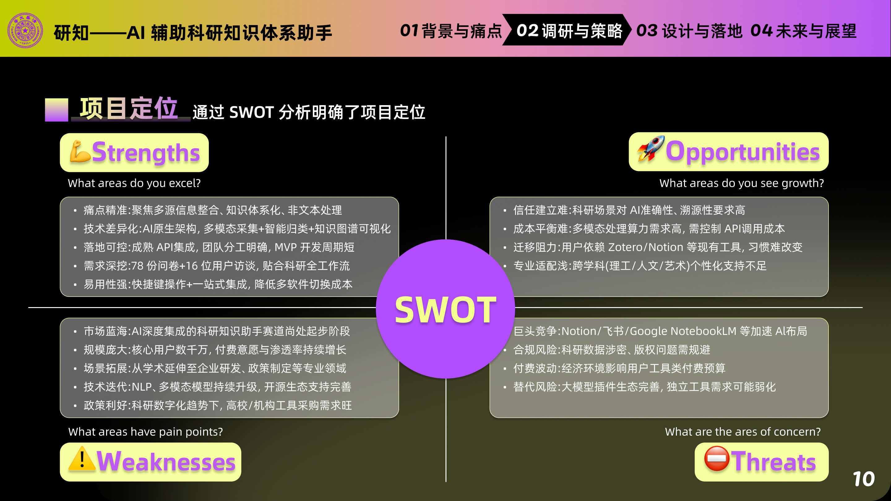
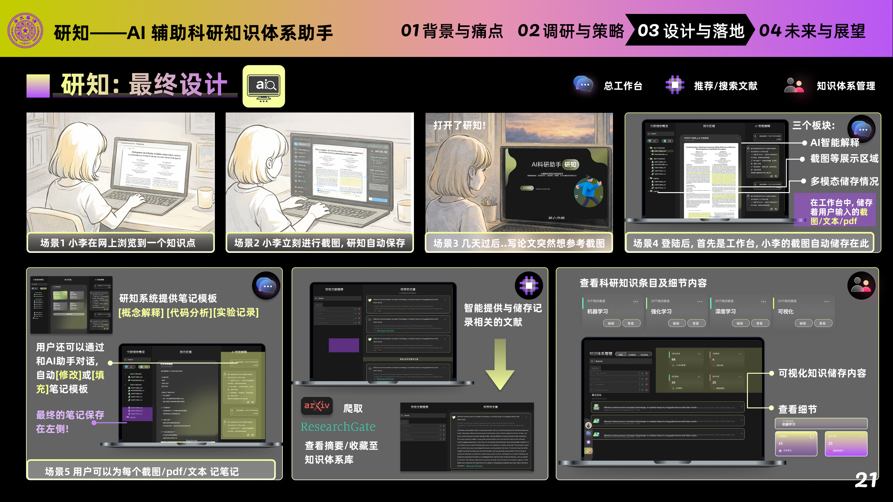

<div align="center">

# 研知科研助手 (Yanzhi Research Assistant)

AI 辅助科研知识体系助手
</br>
<em>Capture, understand, and organize research knowledge with AI.</em>

<p align="center">
  <a href="https://github.com/ddddfrank/yanzhi/stargazers"></a>
  <a href="https://github.com/ddddfrank/yanzhi/network"></a>
  <a href="https://www.electronjs.org/"></a>
  <a href="https://nodejs.org/"></a>
</p>

</div>

研知科研助手是一款专为科研人员打造的智能化工具，旨在通过 AI 技术简化文献管理、笔记整理及知识体系构建流程，全面提升科研效率。

## 👥 合作者

- @Mnnnn- [Mnnnn](https://github.com/liulx25xx)
- @17825470707yx-sketch- [17825470707yx-sketch](https://github.com/17825470707yx-sketch)
- @soulll1- [soulll1](https://github.com/soulll1)
- @ZC_N- [ZC_N](https://github.com/Anachronism-N)

## ⚡ 项目定位

通过 SWOT 分析明确产品定位：聚焦科研场景下的知识捕获、智能理解和结构化沉淀，形成“获取-理解-组织-复用”的闭环。

<div align="center">

</div>

## 🚀 核心功能

| 功能模块 | 核心优势 |
| :--- | :--- |
| **网页信息精准获取** | 支持图片截取、网页保存与文本复制，灵活处理可见内容，覆盖图表与公式场景。 |
| **文献/笔记自动整理** | AI 深度主导，自动生成结构化科研笔记，显著降低人工整理负担。 |
| **定制化笔记模板** | 内置可视化模板构建能力，快速建立标准化科研记录范式。 |
| **知识体系高效构建** | 多层文件夹与条目体系协同，兼顾宏观主题与微观细节管理。 |

## 🎬 核心流程演示

<div align="center">
<table>
<tr>
<td align="center" width="50%">
<strong>1. 新建研究工作区</strong><br/>

</td>
<td align="center" width="50%">
<strong>2. 网页知识捕获（截图/摘录）</strong><br/>

</td>
</tr>
<tr>
<td align="center" width="50%">
<strong>3. 图片截取与保存</strong><br/>

</td>
<td align="center" width="50%">
<strong>4. AI 文献理解与整理</strong><br/>

</td>
</tr>
</table>
</div>

## 🖼️ 最终设计

<div align="center">

</div>

## 🛠️ 环境准备

在开始使用前，请确保系统已安装以下环境：

- **Node.js & npm**：用于运行 Electron 客户端
- **主要 npm 依赖**：
  - `electron`：桌面应用程序框架
  - `openai`：与大模型（如 Qwen）交互
  - `puppeteer-core`：驱动浏览器生成 PDF 或抓取网页
  - `pdf-parse`：解析 PDF 文档
  - `koffi`：Node.js FFI 能力
  - `@paddleocr/paddleocr-js`：浏览器端本地 OCR 推理

## 📦 快速开始

1. **克隆仓库**

```bash
git clone https://github.com/ddddfrank/yanzhi.git
cd yanzhi
```

2. **安装依赖**

```bash
npm install
```

3. **启动程序**

```bash
npm start
```

## ⚙️ 详细配置

### 1. API 配置

本软件默认使用 **本地 PaddleOCR.js + 硅基流动（SiliconCloud）Qwen2.5 7B**：PaddleOCR.js 在 Electron 浏览器上下文内运行 PP-OCRv5 识别截图文字，Qwen 负责后续图像内容解读和整理。

- 前往 [硅基流动官网](https://cloud.siliconflow.cn/) 注册并申请 API Key
- 将申请到的 Key 填入 [data/token.env](data/token.env)（将 txt 后缀改为 env）

### 2. PaddleOCR.js 配置

可选环境变量：

```bash
PADDLEOCR_LANG=ch
PADDLEOCR_VERSION=PP-OCRv5
PADDLEOCR_BACKEND=auto
```

首次安装依赖后先生成浏览器 SDK bundle，并缓存官方 PP-OCRv5 模型到本地：

```bash
npm run build:paddleocr-js
npm run download:paddleocr-js-models
```

### 3. 浏览器配置 (Edge)

程序需要通过远程调试端口操作浏览器以生成 PDF 或抓取内容。

- 右键 Edge 桌面快捷方式，选择“属性”
- 在“目标”栏末尾添加 `--remote-debugging-port=9222`（前面需空格）

### 4. 文件结构配置

在新环境下运行时，请按以下步骤初始化：

- 清空 [data/workspaces](data/workspaces) 目录下旧配置
- 在软件界面选择目标文件夹后，使用“新建文件夹”功能建立科研目录

---

感谢使用研知科研助手！如有问题请查阅 [配置方法.md](配置方法.md) 或提交 Issue。
